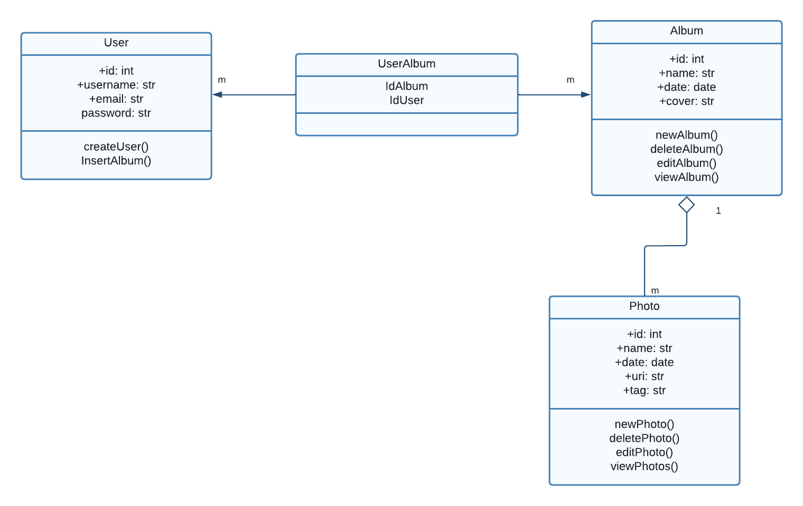
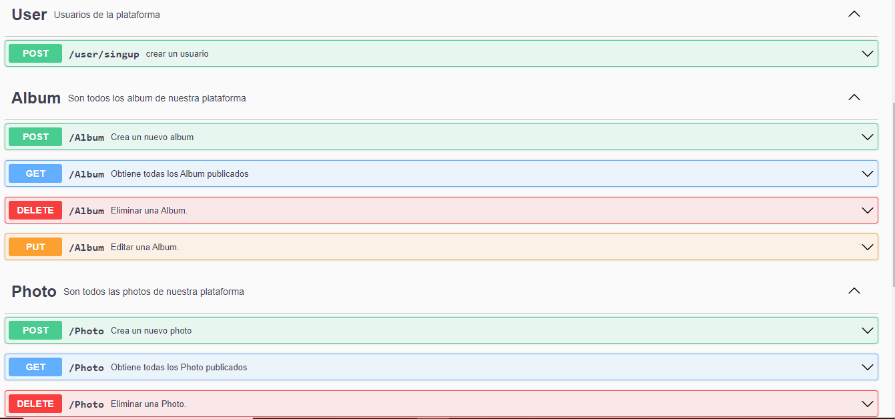
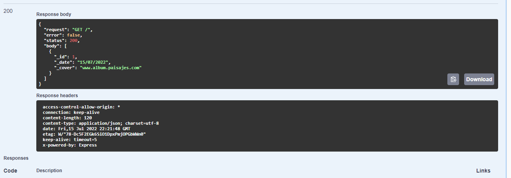
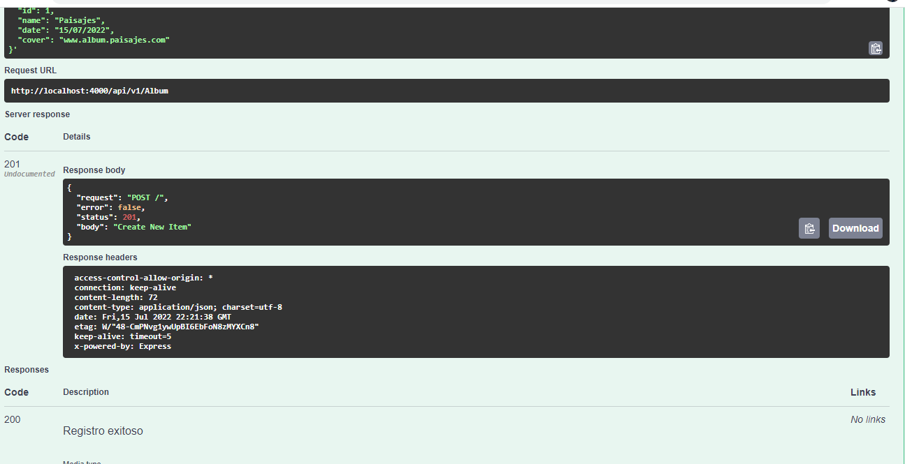

## Disgrama de clases de la aplicacion
se utilizaron 3 clases la clase usuario, que esta estaria relacionada con album
ya que el usuario podria crear diferentes album y esta clase album estaria relacionada
con la clase fotos porque cada album iba a tener un listado de fotos. 

## Documentacion de Swagger
se hizo la documentacion de las 3 clases
album, Usuario y Fotos, con el Crud de cada uno

## Ejemplo de un GET

## Ejemplo de un POST
